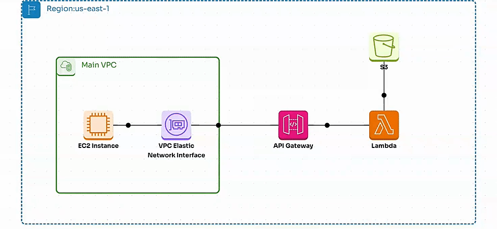

## ** Project Goal ** ## 

The objective of the project is to fetch a JSON file stored in an S3 bucket by utilizing an API Gateway with a private Interface endpoint, backed by a Lambda function

## ** STEPS of The Project ** ## 


### ** 1st STEP ( Terraform) ** ###
Deploy the Terraform configuration files to AWS, which will provision a VPC containing a public subnet, an EC2 instance (Ubuntu with the Python 'requests' package installed), and a key pair that will be automatically generated during the deployment process

Note: because we configure new VPC with Public Subnet- SG require to be assoicated with EC2 to allow SSH  [ You can do it ! ]

Note: There are some notes called : cider_function , element_function, format  ==> explain some function used in Terraform for your reference  

### ** 2nd STEP  Lambda Function ** ###

- S3 Bucket has been created manaully by GUI with File jason inside it  - it is easy setup 
- Lambda Function  [ Lambda-function.py] will be deployed manually 

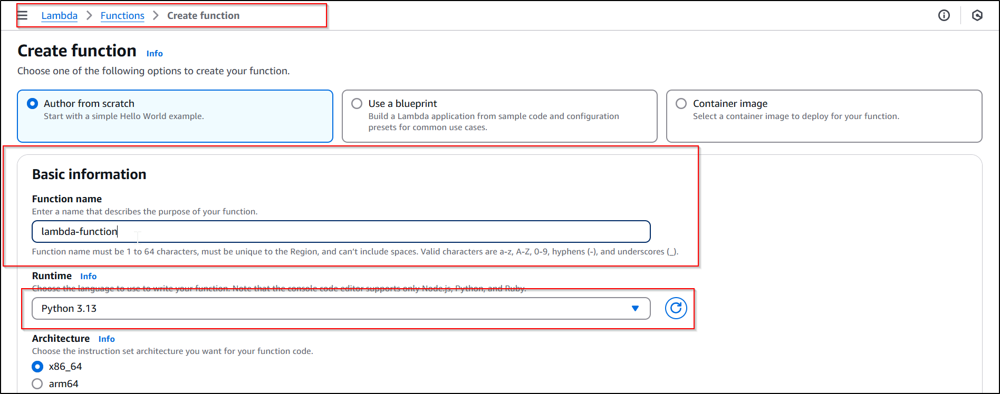


- Test now 
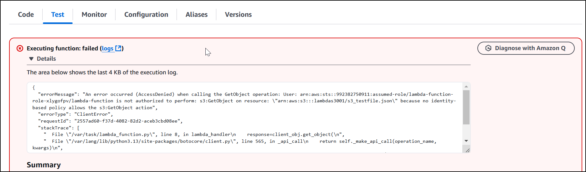 

There is Error because Lambda Function does not have IAM Role , So we need assoicate it 

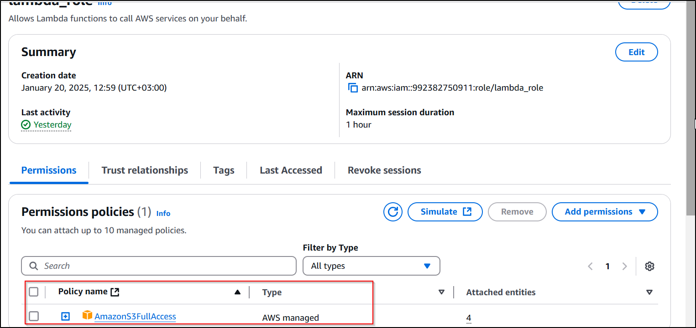 

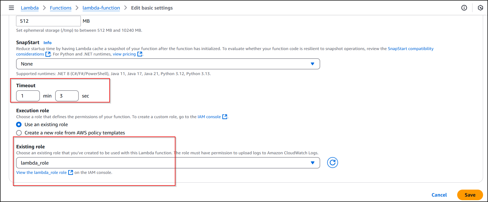 

it wil work now 

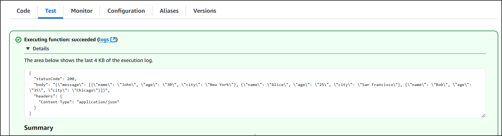


### ** 3rd   STEP  API-GW  ** ###
- Create API gateway , REST API -> choose Private 
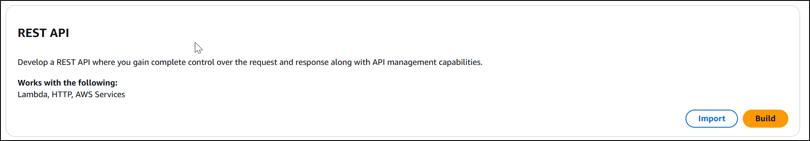 

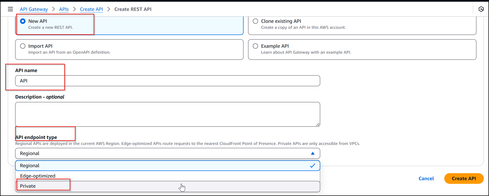 

Then Create Resource 

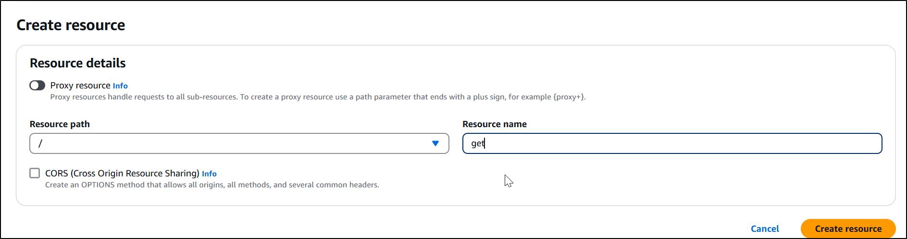

- Create Resource Policy for API Gateway to restrict the access to it 

```json

{
    "Version": "2012-10-17",
    "Statement": [
              {
            "Effect": "Allow",
            "Principal": "*",
            "Action": "execute-api:Invoke",
            "Resource": "*"
        }
    ]
}


Create Method : we will use get , to get the file from S3 Bucket 
Lambda Function which was created in previous step , will be assoicate with API GW

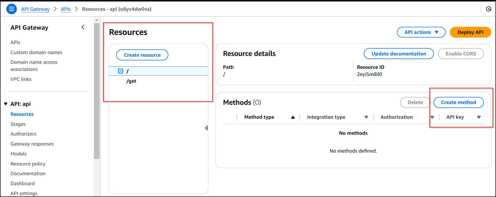

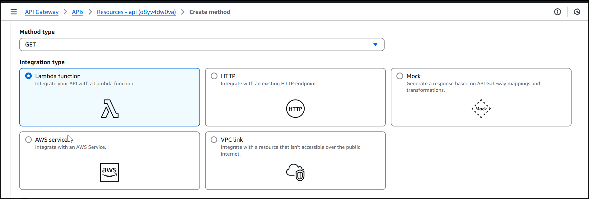 

- Deploy API , Create Stage on the fly 

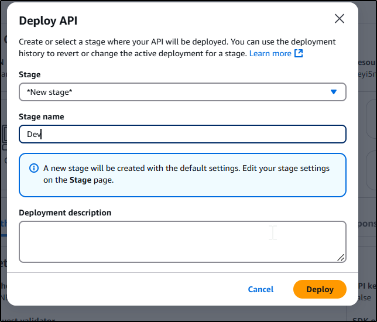

- URL will be created wich will be API URL 


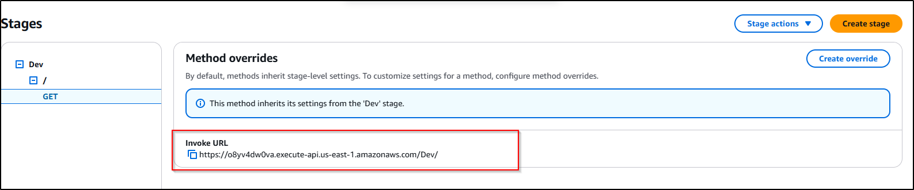


### ** 4th STEP : IAM Role Configuration ** ###
-  EC2 require IAM role to access API Gateway , Create Custom Permission and Custom IAM Role then assoicated with EC2  - The main point is  * execute-api:Invoke *  

```json

{
    "Version": "2012-10-17",
    "Statement": [
        {
            "Effect": "Allow",
            "Action": [
                "execute-api:Invoke"
            ],
            "Resource": "arn:aws:execute-api:us-east-1:992382750911:tr517nrebc/*"
        }
    ]
}

## ** TEST From EC2  ** ##  

- use simple-request.py and Replace API GW URL 
OR
- Curl URL 

